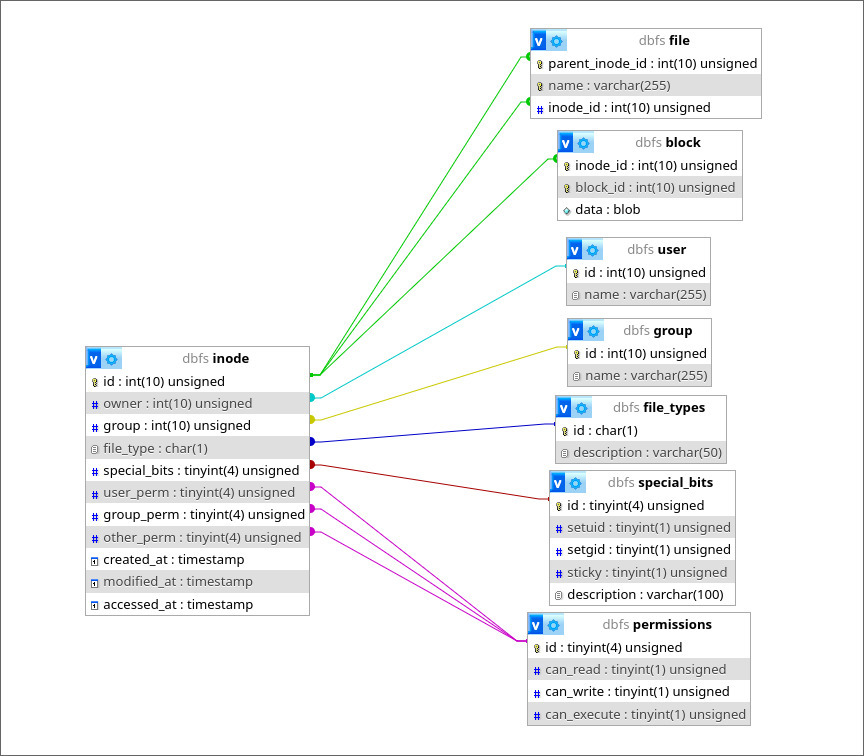

# dbfs

Absolutely sane project. A working fuse adapter for DB-based filesystem.


### Database structure



### Building
Build/test recipes can be viewed with `just -l`.


### Integration testing
To run integration tests:

1. Install dependencies: `podman`, `perl`, `perl-dbd-mysql`, `just`
```bash
sudo pacman -Syu podman perl perl-dbd-mysql just
```
2. Setup integration testing environment with
```bash
just prepare
```
2. Run integration tests
```bash
just test_int
```
3. Stop and clean integration testing environment
```bash
just stop
```
